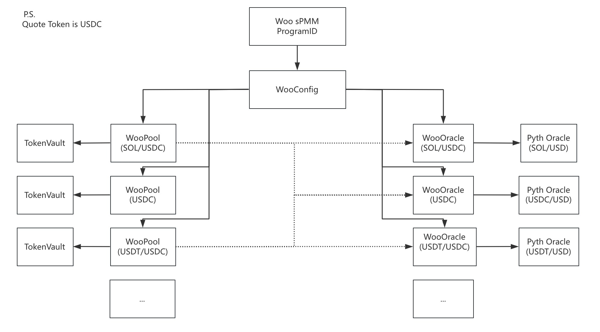

# Architecture

## Architecture Overview

<figure><figcaption><p>WooFi's Overview</p></figcaption></figure>

### Account Structure

WOOFi's sPMM is Synthetic Proactive Market Making (sPMM) contract on the Solana blockchain. This repository contains the Rust smart contract as well as the Typescript SDK (`@woonetwork/WOOFi_Solana`) to interact with a deployed program.

### WooConfig

A WooConfig is a config struct to record:

* authority: Owner of the program
* paused: Whether the program is paused
* Woopool's admin authority
* Wooracle's admin\_authority
* Collect fee authority
* Guardian set authority
* Puase program authority

### WooPool

A WooPool is a concentrated liquidity pool for a token.

Each WooPool account hosts the necessary information to deal with the accounting of the pool. It also hosts the PDAs to the vaults. Only the Woo sPMM program has the authority to withdraw from the vault.

A WooPool account is hashed by the WooConfig, token mint address and quote token mint address.

### WooOracle

A WooOracle is an on-chain price feed in order to simulate the order book from centralized exchanges without sacrificing capital efficiency.

WooFi in Solana uses [Pyth oracle](https://www.pyth.network/developers/price-feed-ids#solana-stable) to check whether Woo oracle's price is valid.

Detail explanation can check on [WooFi Developer Portal](https://learn.woo.org/v/woofi-dev-docs/resources/on-chain-price-feeds)

### Fee rate

Fee rate setting stored in WooPool's fee\_rate param, can be updated by set\_pool\_fee\_rate function by admin.


## WOOFi's sPMM Rust Environment Setup

WOOFi's sPMM is Synthetic Proactive Market Making (sPMM) contract on the Solana blockchain. This repository contains the Rust smart contract as well as the Typescript SDK (`@woonetwork/WOOFi_Solana`) to interact with a deployed program.

### Requirements

* Anchor 0.29.0
* Solana 1.17.31
* Rust 1.72.0

### Setup

Install Anchor using instructions found [here](https://book.anchor-lang.com/getting_started/installation.html#anchor).

Set up a valid Solana keypair at the path specified in the `wallet` in `Anchor.toml` to do local testing with `anchor test` flows.

`$NODE_PATH` must be set to the `node_modules` directory of your global installs. For example, using Node 18.20.4 installed through `nvm`, the $NODE\_PATH is the following:

```
$ echo $NODE_PATH
/Users/<home_dir>/.nvm/versions/node/v18.20.4/lib/node_modules
```

### Usage

### Tests

* Run "cargo test --lib" to run Rust unit tests
