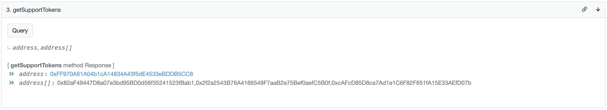

# Integrate WOOFi as a liquidity source

## Contracts

Two main contracts of WOOFi's swap function are as follows:

* `WooPPV2.sol`: the main swap contract that handles the logic operation, including setting the token info, calculating slippage, calculating the exchange amount and executing trades. it stores all tokens that are supported for trading. In this contract, it defines quote token and base token. Quote token is the reference token (i.e. stablecoins) in the contract and there is only one quote token. The contract can have multiple base tokens and they can be added by the strategist.&#x20;
* `WooRouterV2.sol`: the router contract that frontend users interact with. It interacts with the lower layer `WooPPV2.sol` to execute the sell logic and send back users the desired amount of tokens. This contract also implements the logic to route user orders to 3rd party aggregator (e.g. 1inch) when `WooPPV2.sol` does not have sufficient liquidity.

## Supported assets

`WooPPV2.sol` has one quote token which is typically the dominant stablecoin of each chain and multiple base tokens. A `IntegrationHelper.sol` contract is deployed on each supported chain which contains the address of the quote token and the list of tradable base token addresses in `WooPPV2.sol.`

The latest list of supported tokens can be retrieved via the `getSupportTokens()` function which will return two values:

* first value: quoteToken address
* second value: array of baseToken addresses

<figure><figcaption></figcaption></figure>

#### Contract addresses:

Arbitrum: [0x28D2B949024FE50627f1EbC5f0Ca3Ca721148E40](https://arbiscan.io/address/0x28D2B949024FE50627f1EbC5f0Ca3Ca721148E40#readContract)&#x20;

Optimism: [0x96329d66074EB8386Ae8bFD6698B2E3FDA87e15E](https://optimistic.etherscan.io/address/0x96329d66074EB8386Ae8bFD6698B2E3FDA87e15E#readContract)

BSC (USDT as quote - new) - [0xAA9c15cd603428cA8ddD45e933F8EfE3Afbcc173](https://bscscan.com/address/0xAA9c15cd603428cA8ddD45e933F8EfE3Afbcc173)

BSC (BUSD as quote - retiring soon): [0xe12dC1F01ccB71ef00ADd1D8A5116b905261D879](https://bscscan.com/address/0xe12dC1F01ccB71ef00ADd1D8A5116b905261D879#readContract)&#x20;

Avalanche: [0x020630613E296c3E9b06186f630D1bF97A2B6Ad1](https://snowtrace.io/address/0x020630613E296c3E9b06186f630D1bF97A2B6Ad1#readContract)&#x20;

Fantom: [0x6641959FE5EED7166F2254cF04b0d20c96776D9A](https://ftmscan.com/address/0x6641959FE5EED7166F2254cF04b0d20c96776D9A#readContract)&#x20;

Polygon: [0x7Ba560eB735AbDCf9a3a5692272652A0cc81850d](https://polygonscan.com/address/0x7Ba560eB735AbDCf9a3a5692272652A0cc81850d#readContract)

## Integrate WOOFi as a liquidity source

When integrating WOOFi as a liquidity source, you can either interact with `WooRouterV2.sol` or `WooPPV2.sol`.

### Integrating `WooPPV2.sol` &#x20;

Another way is to integrate directly with `WooPPV2.sol`. This approach is slightly more gas efficient, but it requires writing the smart contract code and manually send the `fromToken` to `WooPPV2.sol`, which a better choice for apps that already have an aggregation logic.&#x20;

#### Contract addresses:

Arbitrum: [0xeFF23B4bE1091b53205E35f3AfCD9C7182bf3062](https://arbiscan.io/address/0xeff23b4be1091b53205e35f3afcd9c7182bf3062#code)

Optimism: [0xd1778F9DF3eee5473A9640f13682e3846f61fEbC](https://optimistic.etherscan.io/address/0xd1778F9DF3eee5473A9640f13682e3846f61fEbC#code)

Avalanche: [0x3b3E4b4741e91aF52d0e9ad8660573E951c88524](https://snowtrace.io/address/0x3b3e4b4741e91af52d0e9ad8660573e951c88524#code)

Polygon: [0x7081A38158BD050Ae4a86e38E0225Bc281887d7E](https://polygonscan.com/address/0x7081A38158BD050Ae4a86e38E0225Bc281887d7E#code)

BSC: [0xEc054126922a9a1918435c9072c32f1B60cB2B90](https://bscscan.com/address/0xec054126922a9a1918435c9072c32f1b60cb2b90#code)

Fantom: [0x286ab107c5E9083dBed35A2B5fb0242538F4f9bf](https://ftmscan.com/address/0x286ab107c5E9083dBed35A2B5fb0242538F4f9bf#code)

#### Interface

```solidity

    /// @notice The quote token address (immutable).
    /// @return address of quote token
    function quoteToken() external view returns (address);

    /// @notice Gets the pool size of the specified token (swap liquidity).
    /// @param token the token address
    /// @return the pool size
    function poolSize(address token) external view returns (uint256);

    /// @notice Query the amount to swap `fromToken` to `toToken`, without checking the pool reserve balance.
    /// @param fromToken the from token
    /// @param toToken the to token
    /// @param fromAmount the amount of `fromToken` to swap
    /// @return toAmount the swapped amount of `toToken`
    function tryQuery(
        address fromToken,
        address toToken,
        uint256 fromAmount
    ) external view returns (uint256 toAmount);

    /// @notice Query the amount to swap `fromToken` to `toToken`, with checking the pool reserve balance.
    /// @dev tx reverts when 'toToken' balance is insufficient.
    /// @param fromToken the from token
    /// @param toToken the to token
    /// @param fromAmount the amount of `fromToken` to swap
    /// @return toAmount the swapped amount of `toToken`
    function query(
        address fromToken,
        address toToken,
        uint256 fromAmount
    ) external view returns (uint256 toAmount);

    /// @notice Swap `fromToken` to `toToken`.
    /// @param fromToken the from token
    /// @param toToken the to token
    /// @param fromAmount the amount of `fromToken` to swap
    /// @param minToAmount the minimum amount of `toToken` to receive
    /// @param to the destination address
    /// @param rebateTo the rebate address (optional, can be address ZERO)
    /// @return realToAmount the amount of toToken to receive
    function swap(
        address fromToken,
        address toToken,
        uint256 fromAmount,
        uint256 minToAmount,
        address to,
        address rebateTo
    ) external returns (uint256 realToAmount);

```

#### Sample code

```solidity
    IWooPPV2 public wooPool; // IWooPPV2 smart contrac
    
    function sampleFunc(...) external {
        ... your business code ..

        // query the trade
        address fromToken = WBTC_ADDR;
        address toToken = USDT_ADDR;
        uint256 amountIn = 10000000; // 0.1 btc
        
        uint256 amountOut = wooPool.query(fromToken, toToken, amountIn);
        // or wooPool.tryQuery if you don't need the swap.
 
        // swap
        IERC20(toToken).safeTransfer(address(wooPool), amountIn);
        uint256 realToAmount = wooPool.swap(
            fromToken,
            toToken,
            amountIn,
            amountOut * 99 / 100, 
            address(this),
            address(0)
        );
        
        ... other business code to deal with `toToken` ...
    }
    
```

#### sPMM offchain simulation

For aggregators running offchain routing simulation, you can find the typescript implementation of WOOFi's sPMM algorithm in the github (to be added soon).

### Integrating `WooRouterV2.sol`

The straightforward way is interacting with `WooRouterV2.sol` contract which provides the query and swap for any two specified tokens. It streamlined the logic of swapping native blockchain coin and swapping between any of the two supported assets, which simplifies the integration for apps that do not have an existing aggregation logic.&#x20;

#### Router Contract Addresses

Arbitrum: [0x9aEd3A8896A85FE9a8CAc52C9B402D092B629a30](https://arbiscan.io/address/0x9aed3a8896a85fe9a8cac52c9b402d092b629a30#code)

Optimism: [0xEAf1Ac8E89EA0aE13E0f03634A4FF23502527024](https://optimistic.etherscan.io/address/0xeaf1ac8e89ea0ae13e0f03634a4ff23502527024#code)

Avalanche: [0xC22FBb3133dF781E6C25ea6acebe2D2Bb8CeA2f9](https://snowtrace.io/address/0xc22fbb3133df781e6c25ea6acebe2d2bb8cea2f9#code)

Polygon: [0x817Eb46D60762442Da3D931Ff51a30334CA39B74](https://polygonscan.com/address/0x817eb46d60762442da3d931ff51a30334ca39b74#code)

BSC: [0xC90bFE9951a4Efbf20aCa5ECd9966b2bF8A01294](https://bscscan.com/address/0xc90bfe9951a4efbf20aca5ecd9966b2bf8a01294#code)

Fantom: [0x382A9b0bC5D29e96c3a0b81cE9c64d6C8F150Efb](https://ftmscan.com/address/0x382a9b0bc5d29e96c3a0b81ce9c64d6c8f150efb#code)

**Interface**

```solidity
    /// @dev query the amount to swap fromToken -> toToken
    /// @param fromToken the from token
    /// @param toToken the to token
    /// @param fromAmount the amount of fromToken to swap
    /// @return toAmount the predicted amount to receive
    function querySwap(
        address fromToken,
        address toToken,
        uint256 fromAmount
    ) external view returns (uint256 toAmount);
    
    /// @dev query the amount to swap fromToken -> toToken,
    ///      WITHOUT checking the reserve balance; so it
    ///      always returns the quoted amount (for reference).
    /// @param fromToken the from token
    /// @param toToken the to token
    /// @param fromAmount the amount of fromToken to swap
    /// @return toAmount the predicted amount to receive
    function tryQuerySwap(
        address fromToken,
        address toToken,
        uint256 fromAmount
    ) external view returns (uint256 toAmount);
    
    /// @notice Swap `fromToken` to `toToken`.
    /// @param fromToken the from token
    /// @param toToken the to token
    /// @param fromAmount the amount of `fromToken` to swap
    /// @param minToAmount the minimum amount of `toToken` to receive
    /// @param to the destination address
    /// @param rebateTo the rebate address (optional, can be 0)
    /// @return realToAmount the amount of toToken to receive
    function swap(
        address fromToken,
        address toToken,
        uint256 fromAmount,
        uint256 minToAmount,
        address payable to,
        address rebateTo
    ) external payable returns (uint256 realToAmount);
```

**Sample code**

<pre class="language-solidity"><code class="lang-solidity">// Query Part
address fromToken = 0x2f2a2543B76A4166549F7aaB2e75Bef0aefC5B0f;  // wbtc
address toToken = 0xFF970A61A04b1cA14834A43f5dE4533eBDDB5CC8;    // usdc
uint256 amount1 = wooRouter.querySwap(
  fromToken, 
  toToken,
  100000000  // 1 wbtc amount in decimal 8
)

<strong>uint256 amount2 = wooRouter.tryQuerySwap(
</strong>  fromToken,
  toToken,
  100000000); // 1 wbtc amount in decimal 8

// NOTE: when the balance reserve is enough for swap, amount1 = amount2;
// otherwise, amount2 is still calculated based on wooracle price and woo market-making
// formula, but the amount1 qeury simply failed with insufficient balance error.


// Swap Part
uint256 amountIn = 100000000;
IERC20(fromToken).safeApprove(address(wooRouter), amountIn);
uint256 realToAmount = wooRouter.swap(
  fromToken,      // wbtc token address
  toToken,        // usdc token address
  amountIn,       // wbtc amount to swap in decimal 8
  19000000000,    // min amount = 19000 usdc (price: 19500)
  address(this),  // the address to receive the swap fund
  address(0)      // the rebateTo address
); 
</code></pre>
